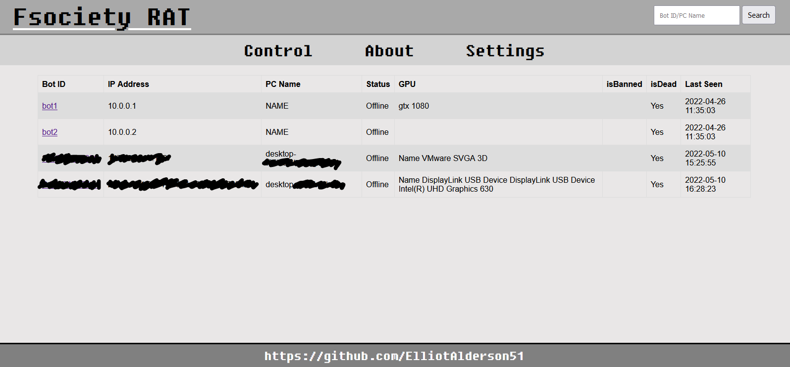
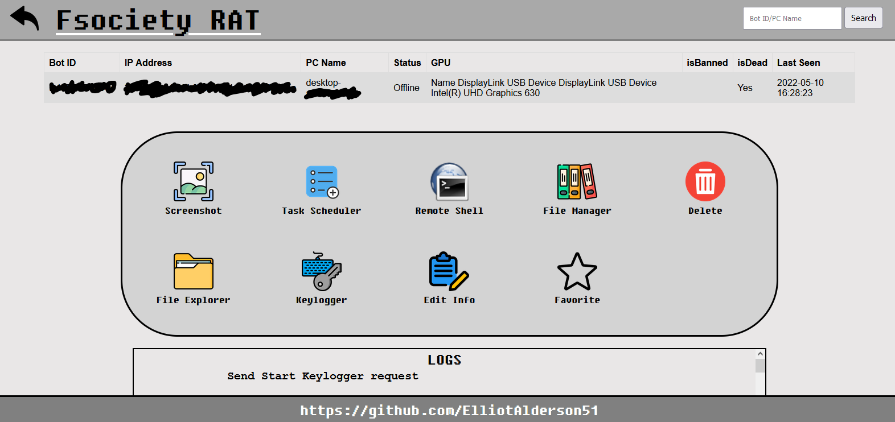

# Fsociety-RAT
It was really fun to make this project! This project have a lot of great fetures and an very good website control of the bots.

The final Malware per bypassing UAC, installing rootkit on 32 bit systems, obfuscated strings, Anti-VM technique, Process Hollowing , Communicate with the website control using CURL (curl is preinstalled in every windows!). 

## RAT

### Malware Persistence Techniques

:heavy_check_mark: The malware hiding a DLL to bypass UAC and a Rootkit in new sections.    
:heavy_check_mark: Bypassing UAC using UAC hijacking on the program ComputerDefaults.exe in a "Windows " folder.    
:heavy_check_mark: Create a task for the malware in Task Schduler in the path "Microsoft\\Windows\\Security" with high privileges.    
:heavy_check_mark: If the system is 32-bit install and start the rootkit.    
:heavy_check_mark: If the system is 64-bit the malware will start Process Hollowing    

### Malware Attacks
The malware communicate with a control website, this is the current attacks:

:heavy_check_mark: Screenshot    
:heavy_check_mark: Task Scheduler       
:heavy_check_mark: Remote Shell    
:heavy_check_mark: File Manager    
:heavy_check_mark: File Explorer    
:heavy_check_mark: Keylogger    
:heavy_check_mark: Client Info    

### Website Control Images
Main website control - list the clients and show info about them



Victim profile page




## Rootkit
The Rootkit is for 32-bit systems. https://github.com/ElliotAlderson51/Kernel-Rootkit-32Bit

### What the Rootkit can do?

#### Hook the SSDT

:heavy_check_mark: Protect Files (Read\Write\Create\Delete\Rename\Open\Execute)     
:heavy_check_mark: Hide Process    
:heavy_check_mark: Protect Process, Thread     
:heavy_check_mark: Protect Registry Keys (Open\Create\Delete\Set)        
:heavy_check_mark: Bypass privilege checks

## DLL - Bypass UAC
Create a DLL that will be hijacked to ComputerDefaults to start the malware with high privilege.

## section_injector
This Projects will inject a file to new section in another file.
```
Injector.exe "section name" "target" "file"
```

## Sub Projects
This solutions was helping me to build the final malware

### Initialize RAT
This automated the build of the final malware.

:heavy_check_mark: UPX the DLL file     
:heavy_check_mark: Inject the DLL and the Rootkit to new sections.

### Encoding_Decoding
This helps me to obfuscate the strings in the malware.

## TODO

* Obfuscate Imports
